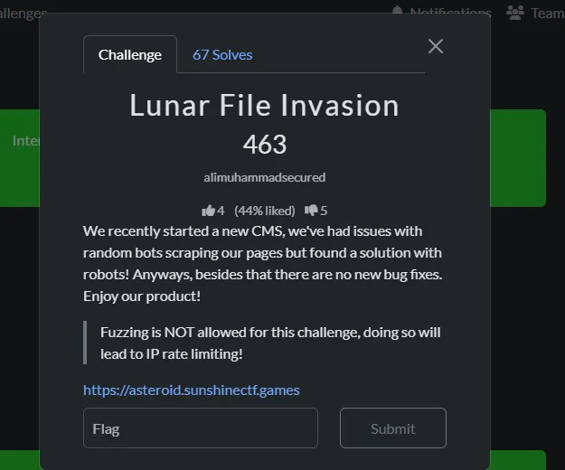
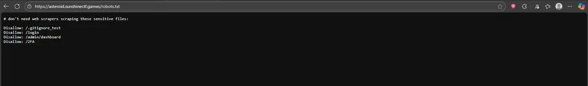
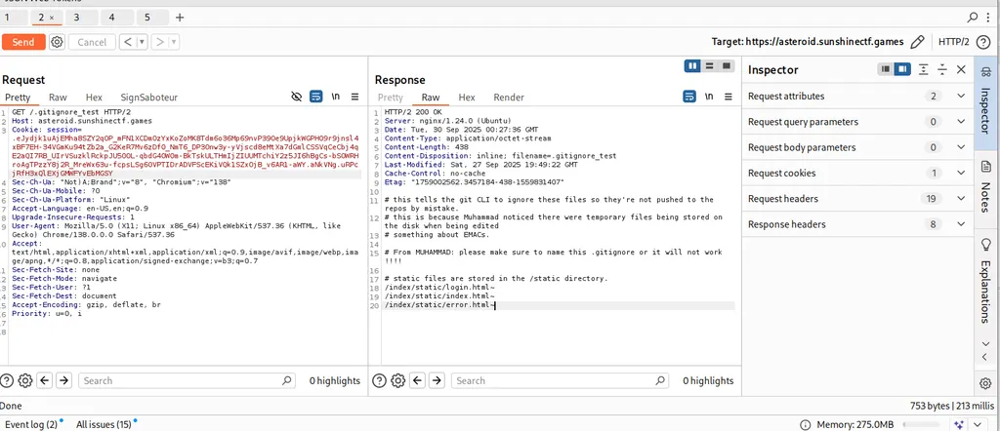
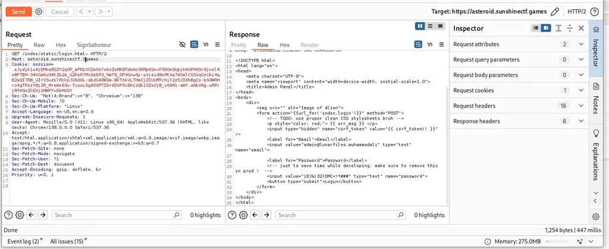
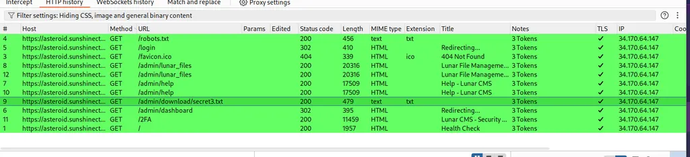
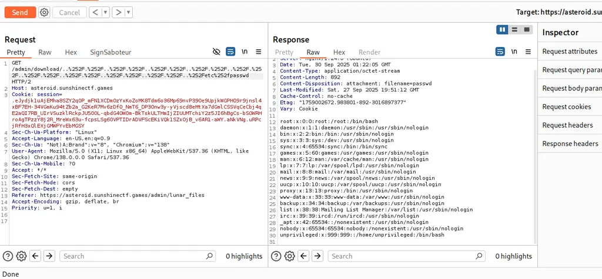
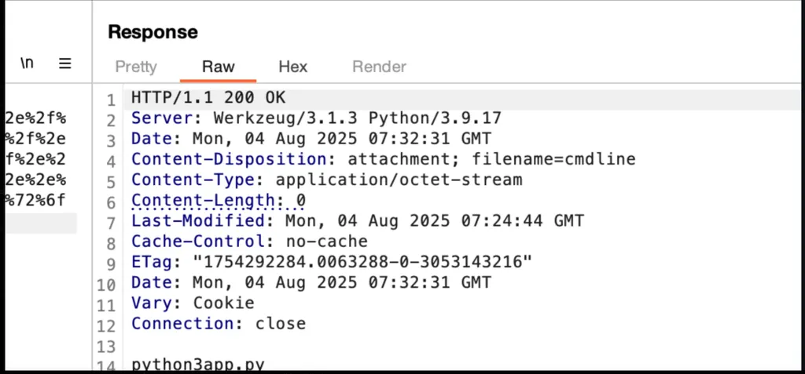
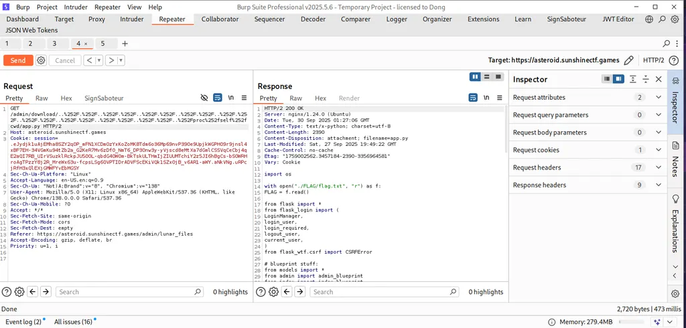
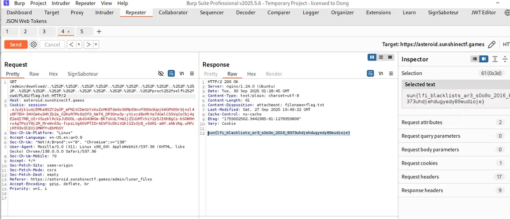

# Lunar File Invasion



Recon thôi.



Ở đây ta thấy một đường dẫn là ./gitignore file hay dùng để bỏ qua những file không muốn gửi lên github, tránh lộ thông tin nhạy cảm. Ở đây thì có thể xem file đó làm gì.



Có một file /index/static/login.html~ kiểm tra luôn.



Rồi luôn, có cả tài khoản và mật khẩu:

<div>

<form action="{{url_for('index.login')}}" method="POST">
<!-- TODO: use proper clean CSS stylesheets bruh -->
<p style="color: red;"> {{ err_msg }} </p>
<input type="hidden" name="csrf_token" value="{{ csrf_token() }}" />
<label for="Email">Email</label>
<input value="admin@lunarfiles.muhammadali" type="text" name="email">

```
        <label for="Password">Password</label>
        <!-- just to save time while developing, make sure to remove this in prod !  -->
        <input value="jEJ&(32)DMC<!*###" type="text" name="password">
        <button type="submit">Login</button>
    </form>
</div>

```

Và hãy nhớ là có một endpoint bị lộ ở robots đó chính là /login lấy tài khoản này vào.


Khi vào thì nó dẫn ta đến trang này , ban đầu mình ghĩ đến ý tưởngt bruforce nhma mã pin 10 số thì cũng hơi rén , vì độ phức tạo cao quá.

Có một endpoint cũng đáng nhắm đến đó là ./admin/dashboard

Đường dẫn trên sẽ dẫn chúng ta đến giao diện này.


Đi thẳng vào chức năng manage files.


Xem từng file thì tương ứng nó gọi một API như này:



Tức là nó sẽ down từ backend xuống fontend để hiển thị và như đề bài là Lunar File Invasion mình nghĩ nó là lỗi LFI , đây có thể là hint, hơn nữa trong file secret2.txt có đề cập đến việc những hacker dùng kỹ thuật trên hatrick để đánh cắp thông tin .

https://book.hacktricks.wiki/en/pentesting-web/file-inclusion/index.html

Và sau khi nghiên cứu và thử các payload , để filter bypass thì kết quả nó dẫn đến là :



Nó chính là kiểu double encode nhưng mà trước đó mình cũng đã thử, kiểu này và thất bại, nhận về thông báo là file không tồn tại, nhưng mình không thể ngờ được là do mình lùi chưa đủ sâu để khám phá được nội dung file này.

Từ đây mình sẽ tiến hành đi tìm đường dẫn flag.

Mình sẽ thử một đường dẫn hệ thông như sau: /proc/self/cmdline



LÀm lộ đường dẫn [app.py](http://app.py), nhưng mà để vào được app.py phải truy cập từ đường dẫn mặc định hiện tại làm việc ở đây có một đường dẫn như vậy đại diện cho đường dẫn hiện tại làm việc đó là /proc/self/cwd(đường dẫn này để hiểu thêm thì bạn có thể xem ở trang hatrick mình để ở trên).

Ta thử như này đi: /proc/self/cwd/app.py



Payload:

GET /admin/download/..%252F.%252F..%252F.%252F..%252F.%252F..%252F.%252F..%252F.%252F..%252F.%252F..%252F.%252F..%252F.%252F..%252F.%252F..%252Fproc%252fself%252fcwd/app.py

Và flag của chúng ta nằm ở ./FLAG/flag.txt


