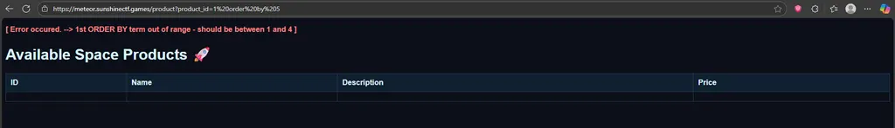

# Lunar Shop

Thử thách này được mô tả là có mặt hàng flag không được phát hành , đi vào giao diện trang web ta thấy như sau:

Có 3 product được phát hành xem từng cái ,

Ứng với mỗi id thì sẽ có một mặt hàng tương ứng với mô tả , ở đây ban đầu mình nghĩ là sẽ thử id từ 1 đến 100 để bắt flag nhưng mà thất bại , còn một cách khác đó là ta sẽ test thử SQL injection

payload : 1 order by 5  

cho ta thông báo 

Vậy chỉ có 4 cột thôi thay vì fuzzing mình sẽ thử thẳng cột flag ở bảng flag luôn, dù chưa khoa học nhưng sẽ là chuẩn đoán ban đầu.

May mắn là có luôn nên ta không cần mắc nhiều thời gian để fuzz.