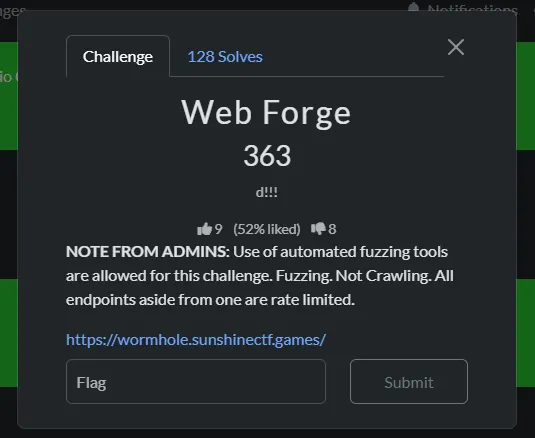
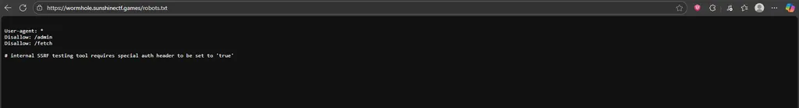
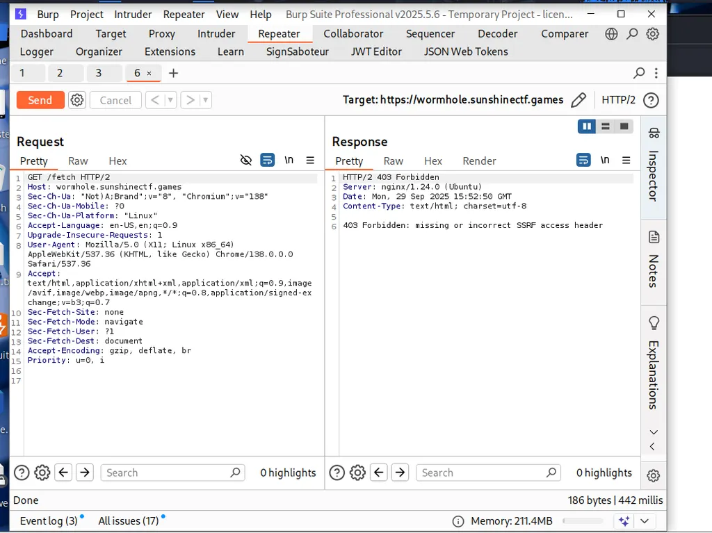

# Web Force

Thử thách này cho phép fuzzing và là cũng là một bài blackbox .

File robots.txt cho ta các uri sau và hint có một header được set giá trị là true thì sẽ dùng được một SSRF tool và điều đó được áp dụng với trang này:

Mình sẽ fuzzing trường header chỗ này và fix cứng giá trị true cho nó , list mình sử dụng là:

https://github.com/danielmiessler/SecLists/blob/master/Discovery/Web-Content/BurpSuite-ParamMiner/lowercase-headers

Và quan sát status trả về để xác định thôi.

Có một trường Allow: true cho status 200.

Nó có một URL để ta nhập test SSRF mình sẽ thử một payload kinh điển: http://127.0.0.1/admin

Tại sao mình lại thử trang admin vì mình đã thử endpoint /admin ban đầu và được trả về 403 forbiden

Có một thông báo lỗi là thiếu tham số template ở admin nên mình sẽ thêm: http://127.0.0.1/admin?template=Jinja

Kết nối bị từ chối , có thể là do cổng không đúng , ở đây mình sẽ intruder các cổng hợp lệ và phát hiện cổng đúng sẽ là 8000.

À ha , nó hiện ra chuỗi jinja là giá trị của template luôn, có sự reflect ở đây nên mình sẽ test luôn SSTI.

Oke , có thể là JInja PYTHON và chắc chắn là lỗi SSTI. Mình sẽ dùng payload này để thực hiện fuzz: [PayloadsAllTheThings/Server Side Template Injection/Intruder/ssti.fuzz at master · swisskyrepo/PayloadsAllTheThings](https://github.com/swisskyrepo/PayloadsAllTheThings/blob/master/Server%20Side%20Template%20Injection/Intruder/ssti.fuzz)

[http://127.0.0.1:8000/admin?template={{request|attr('application')|attr('\x5f\x5fglobals\x5f\x5f')|attr('\x5f\x5fgetitem\x5f\x5f')('\x5f\x5fbuiltins\x5f\x5f')|attr('\x5f\x5fgetitem\x5f\x5f')('\x5f\x5fimport\x5f\x5f')('os')|attr('popen')('id')|attr('read')()}}](http://127.0.0.1:8000/admin?template=%7b%7brequest%7cattr(%27application%27)%7cattr(%27%5cx5f%5cx5fglobals%5cx5f%5cx5f%27)%7cattr(%27%5cx5f%5cx5fgetitem%5cx5f%5cx5f%27)(%27%5cx5f%5cx5fbuiltins%5cx5f%5cx5f%27)%7cattr(%27%5cx5f%5cx5fgetitem%5cx5f%5cx5f%27)(%27%5cx5f%5cx5fimport%5cx5f%5cx5f%27)(%27os%27)%7cattr(%27popen%27)(%27id%27)%7cattr(%27read%27)()%7d%7d)

Có một payload trả về giá trị id luôn quá là tuyệt vời, phát triển tiếp thôi.

'ls' thì hiện ra list file trong đó có file flag.txt chính là mục tiêu của ta bây giờ đọc nó thôi.

Ayda nhưng mà nó hình như bị filter rồi , nhưng mà không biết nó bị filter ở chữ cat hay là flag.txt sau khi test thử chỉ ghi là cat thì nó không hiện chữ 'Nope ' nên mình nghĩ chắc là thằng này đang filter flag.txt chẳng hạn . Nên mình quyết định thử là : cat flag*

Và chính nó rồi.